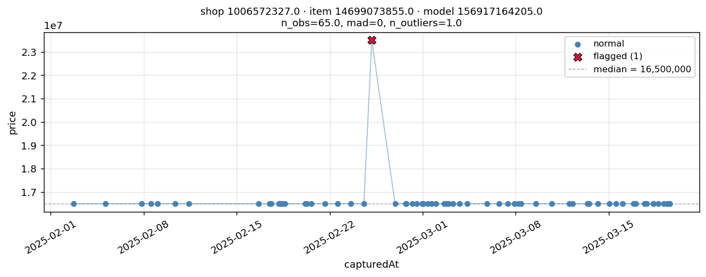

#Price Prediction Pipeline

This project solves an outage-day price. The goal is to reconstruct the missing product prices as accurately as possible using historical data and the anchor rows.

Three approaches were tested:

- **Approach 1 — Naive Global LightGBM**
- **Approach 2 — Per-Product Ridge Regression**
- **Approach 3 — Global LightGBM with historical features and anchor calibration**

The final selected approach is **Approach 3**, because it combines product history, marketplace-wide anchor signals, category-level correction, and robust log-space modelling.

---

## 1. Data Cleaning and Feature Engineering

### 1.1 Exploratory Data Analysis

#### Price stability

Around **84% of products have constant prices across all observations**. This means that for most products, price does not change often. Therefore, `last_price` becomes the dominant predictor.

### 1.2 Outlier Detection and Data Cleaning
Outlier detection was performed for each product to identify anomalies in the price data. During the process, some flagged observations appeared at the trailing end of the series, which made them tricky to handle since it was unclear whether they represented true anomalies or actual price changes. To avoid incorrectly removing potential price changes, these trailing flagged points were unflagged.




---

### 1.3 Temporal Features

Several date-based features were created:

- `dow` — day of week;
- `dom` — day of month;
- `month`;
- `is_weekend`;
- `is_double_date`.

The `is_double_date` feature captures dates where the day equals the month, such as:

- 1.1;
- 2.2;
- 3.3;
- 11.11;
- 12.12.

These dates are important because Indonesian e-commerce platforms often run flash-sale events on double-date days.

---

### 1.4 Categorical Features

The following identifiers were used as categorical features:

- `shopId`;
- `itemId`;
- `modelId`;
- `cat_id`;
- `brand`.

LightGBM can handle categorical variables natively, so no one-hot encoding was required for the global models.

For the per-product Ridge model, the entity grouping itself represents product identity. Therefore, no explicit categorical encoding was needed for that approach.

---

### 1.5 History-Derived Features

The full pipeline uses product history features. These are created only from past observations to avoid leakage.

Important historical features include:

- `last_price`;
- all-time mean price;
- all-time median price;
- all-time standard deviation;
- all-time minimum price;
- all-time maximum price;
- historical observation count;
- last 5 observations mean and median;
- last 20 observations mean and median;
- discount frequency;
- average discount depth;
- maximum discount depth;
- shop-level median price;
- category-level median price.

Several derived ratio features were also added:

- `last_vs_mean`;
- `momentum_short`;
- `momentum_long`.

All historical features were generated using leak-free time-aware joins, This ensures that the model only uses information available before the prediction date.

---

### 1.6 Anchor-Derived Features

The anchor rows are one of the most important parts of the pipeline.

On each outage day, 100 products have known prices. These rows are used to estimate the same-day marketplace condition.

From the anchor rows, the pipeline creates:

- `day_avg_discount`;
- `day_promo_rate`;
- `day_free_ship`;
- `cat_disc_shrunk`.

These features are then stamped onto all target rows from the same date.

## 2. Models

Two model families were used in this project:

1. **LightGBM**
2. **Ridge Regression**

Each model was chosen for a specific purpose. LightGBM was chosen for the global models because the dataset is mainly a tabular machine learning problem.

The data contains:

- product identifiers;
- shop identifiers;
- category identifiers;
- brand information;
- date features;
- historical price aggregates;
- anchor-derived marketplace features.

LightGBM is suitable for this type of data because it:

- performs well on structured tabular datasets;
- captures non-linear relationships between features;
- handles interactions between categorical, temporal, and historical variables;
- supports categorical features without requiring heavy one-hot encoding;
- is robust and fast to train;
- works well with medium-sized datasets;
- supports objectives such as L1 loss, which is useful when the target has outliers.

In this project, LightGBM is used for:

- **Approach 1**, the global baseline model;
- **Approach 3**, the full history-based pipeline.


Ridge Regression was chosen for the per-product modelling approach. In Approach 2, one model is trained for each product entity:

```text
(shopId, itemId, modelId)
```

This setup creates many small datasets, because each product usually has only a limited number of historical observations.
Ridge Regression is appropriate for this situation because:

- it works well with small sample sizes;
- L2 regularization reduces overfitting;
- it is simple and stable;
- it provides a clean way to test whether product-specific modelling helps.

---

### 3. Anchor Calibration

After raw predictions are generated, same-day anchor rows are used for post-hoc calibration.
The calibration has two layers.

#### L1 — Global multiplicative . The first layer estimates a global correction factor

#### L2 — Per-category bias - The second layer estimates category-level residuals from the anchor rows. Because each category may have only a few anchors, empirical-Bayes shrinkage is used to pull category estimates toward the global bias. This allows the model to capture category-specific effects while avoiding overfitting to categories with very few anchor examples.
--

## 4. Metric Summary

### 4.1 Validation Methodology

Validation is performed using a time-based holdout.

The last three days of the training set are treated as simulated outage days. For each day:

1. 100 rows are sampled as fake anchors.
2. The model predicts the remaining rows.
3. The predictions are calibrated using the fake anchors.
4. Metrics are calculated on the target rows.


---
### 4.2 Validation Results

The table below summarizes the validation performance across the simulated outage days.

| Method | MAPE | MedAPE | MAE | RMSE | n |
|---|---:|---:|---:|---:|---:|
| A1 raw | 12.0628 | 0.1656 | 3,114,666.61 | 23,367,938.90 | 20,619 |
| A1 + calibration | 12.0601 | 0.1639 | 3,114,670.60 | 23,368,907.71 | 20,619 |
| A2 raw | 0.7910 | 0.0000 | 299,164.81 | 1,684,861.13 | 20,294 |
| A2 + calibration | 0.8467 | 0.0000 | 318,379.73 | 1,677,754.83 | 20,294 |
| A3 raw | 0.0934 | 0.0000 | 19,769.48 | 680,440.60 | 20,474 |
| A3 + calibration| 0.0934 | 0.0000 | 19,769.48 | 680,440.60 | 20,474 |

---

## 5. How to Make Predictions

### 5.1 Install Requirements

First, install the required Python packages:

```bash
pip install -r requirements.txt
```

---

### 5.2 Run Prediction Script

To generate predictions for a test file, run:

```bash
python make_predictions.py <test_file> <model_name>
```

Example:

```bash
python make_predictions.py data/test.csv a3_global
```
or

```bash
python make_predictions.py data/test.csv
```
The program will use default model (a3_global)


### 5.3 Expected Output

The prediction output will be saved under data/prediction_output. The output file contains the predicted prices for the target rows.
