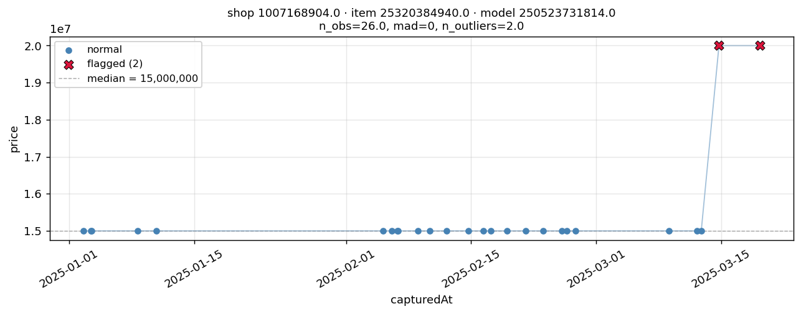

#Price Prediction Pipeline

This project solves an outage-day price. The goal is to reconstruct the missing product prices as accurately as possible using historical data and the anchor rows.

Three approaches were tested:

- **Approach 1 — Naive Global LightGBM**
- **Approach 2 — Per-Product Ridge Regression**
- **Approach 3 — Global LightGBM with historical features and anchor calibration**

The final selected approach is **Approach 3**, because it combines product history, marketplace-wide anchor signals, category-level correction, and robust log-space modelling.

---

## 2. Data Cleaning and Feature Engineering

### 2.1 Exploratory Data Analysis

#### Price stability

Around **84% of products have constant prices across all observations**. This means that for most products, price does not change often. Therefore, `last_price` becomes the dominant predictor.

### 2.2 Outlier Detection and Data Cleaning
Outlier detection was performed for each product to identify anomalies in the price data. During the process, some flagged observations appeared at the trailing end of the series, which made them tricky to handle since it was unclear whether they represented true anomalies or actual price changes. To avoid incorrectly removing potential price changes, these trailing flagged points were unflagged.

```markdown

```

```markdown

```

---

### 2.3 Temporal Features

Several date-based features were created:

- `dow` — day of week;
- `dom` — day of month;
- `month`;
- `is_weekend`;
- `is_double_date`.

The `is_double_date` feature captures dates where the day equals the month, such as:

- 1.1;
- 2.2;
- 3.3;
- 11.11;
- 12.12.

These dates are important because Indonesian e-commerce platforms often run flash-sale events on double-date days.

---

### 2.4 Categorical Features

The following identifiers were used as categorical features:

- `shopId`;
- `itemId`;
- `modelId`;
- `cat_id`;
- `brand`.

LightGBM can handle categorical variables natively, so no one-hot encoding was required for the global models.

For the per-product Ridge model, the entity grouping itself represents product identity. Therefore, no explicit categorical encoding was needed for that approach.

---

### 2.5 History-Derived Features

The full pipeline uses product history features. These are created only from past observations to avoid leakage.

Important historical features include:

- `last_price`;
- all-time mean price;
- all-time median price;
- all-time standard deviation;
- all-time minimum price;
- all-time maximum price;
- historical observation count;
- last 5 observations mean and median;
- last 20 observations mean and median;
- discount frequency;
- average discount depth;
- maximum discount depth;
- shop-level median price;
- category-level median price.

Several derived ratio features were also added:

- `last_vs_mean`;
- `momentum_short`;
- `momentum_long`.

All historical features were generated using leak-free time-aware joins, especially:

```python
merge_asof(..., allow_exact_matches=False)
```

This ensures that the model only uses information available before the prediction date.

---

### 2.6 Anchor-Derived Features

The anchor rows are one of the most important parts of the pipeline.

On each outage day, 100 products have known prices. These rows are used to estimate the same-day marketplace condition.

From the anchor rows, the pipeline creates:

- `day_avg_discount`;
- `day_promo_rate`;
- `day_free_ship`;
- `cat_disc_shrunk`.

These features are then stamped onto all target rows from the same date.

#### Category-level anchor shrinkage

The feature `cat_disc_shrunk` estimates category-level discount conditions on the outage day.

Because some categories have very few anchor rows, the category estimate is shrunk toward the median category discount level.

The median is used instead of the mean because the `show_discount` distribution is bimodal. Using the mean would over-smooth categories and create less stable correction values.

---

### 2.7 Cold-Start Handling

For products with limited or no history, the pipeline uses a fallback chain:

```text
last_price → shop_price_median → cat_median → global_median
```

This ensures that every product can still receive a reasonable prediction even when historical observations are missing.

---

## 3. Model Explanation and Why We Chose the Model

Two model families were used in this project:

1. **LightGBM**
2. **Ridge Regression**

Each model was chosen for a specific purpose.

---

### 3.1 Why LightGBM Was Chosen

LightGBM was chosen for the global models because the dataset is mainly a tabular machine learning problem.

The data contains:

- product identifiers;
- shop identifiers;
- category identifiers;
- brand information;
- date features;
- historical price aggregates;
- anchor-derived marketplace features.

LightGBM is suitable for this type of data because it:

- performs well on structured tabular datasets;
- captures non-linear relationships between features;
- handles interactions between categorical, temporal, and historical variables;
- supports categorical features without requiring heavy one-hot encoding;
- is robust and fast to train;
- works well with medium-sized datasets;
- supports objectives such as L1 loss, which is useful when the target has outliers.

In this project, LightGBM is used for:

- **Approach 1**, the global baseline model;
- **Approach 3**, the full history-based pipeline.

---

### 3.2 Why Ridge Regression Was Chosen

Ridge Regression was chosen for the per-product modelling approach.

In Approach 2, one model is trained for each product entity:

```text
(shopId, itemId, modelId)
```

This setup creates many small datasets, because each product usually has only a limited number of historical observations. The median number of observations per product is around 15.

Ridge Regression is appropriate for this situation because:

- it works well with small sample sizes;
- L2 regularization reduces overfitting;
- it is simple and stable;
- it provides a clean way to test whether product-specific modelling helps.

The goal of Approach 2 is not to build the final strongest model. Instead, it is used as an experiment to answer this question:

```text
Does per-product modelling alone improve performance?
```

To keep this comparison fair, `last_price` was deliberately excluded from Approach 2. If `last_price` were included, the model would mostly benefit from historical price memory, making it unclear whether the improvement came from personalization or from price history.

---

### 3.3 Anchor Calibration

After raw predictions are generated, same-day anchor rows are used for post-hoc calibration.

The calibration has two layers.

#### L1 — Global multiplicative bias

The first layer estimates a global correction factor using the median log-residual on the anchor rows.

This captures marketplace-wide shifts, such as:

- broad discount days;
- platform-wide promotional effects;
- global price movement on the outage day.

#### L2 — Per-category bias

The second layer estimates category-level residuals from the anchor rows.

Because each category may have only a few anchors, empirical-Bayes shrinkage is used to pull category estimates toward the global bias.

This allows the model to capture category-specific effects while avoiding overfitting to categories with very few anchor examples.

Each calibration layer is fitted only on the anchor rows of the same day and applied only to target rows from that same day.

---

### 3.4 Trade-Offs per Approach

#### Approach 1 — Naive Global LightGBM

Approach 1 uses one global LightGBM model trained on categorical IDs, temporal features, and anchor-derived marketplace features. It predicts:

```text
log(price)
```

directly.

##### Advantages

- Simple and stable baseline.
- Has full coverage for all products.
- Can learn global relationships across shops, categories, brands, and dates.
- Uses only features that are available at inference time.
- Easy to train and maintain.

##### Limitations

- Does not fully use product-specific price history.
- Can struggle when a product's historical price level is very different from other products in the same category.
- Predicting `log(price)` directly means the model has to learn both the product price level and the price movement.
- Less effective for products where the last observed price is clearly the best predictor.

##### Trade-off summary

Approach 1 provides strong coverage and simplicity, but it does not exploit the most important signal in the data: the last observed product price.

---

#### Approach 2 — Per-Product Ridge Regression

Approach 2 trains one Ridge Regression model per product entity:

```text
(shopId, itemId, modelId)
```

It uses temporal and anchor-derived features, but deliberately excludes `last_price`.

##### Advantages

- Captures product-specific behavior.
- Simple and interpretable.
- Ridge regularization helps reduce overfitting.
- Useful for testing whether personalization alone improves performance.
- Works better than tree-based models when each product has very few observations.

##### Limitations

- Coverage is not complete because products with too few observations cannot train a reliable per-product model.
- Some product-level models are trained on very small datasets.
- Without `last_price`, it does not fully benefit from historical price stability.
- Maintenance is more complex because many small models must be trained and stored.
- Performance may vary depending on the amount of history available for each product.

##### Trade-off summary

Approach 2 tests personalization, but personalization alone is not enough. It can be useful for products with enough history, but it has limited coverage and does not clearly dominate the global model.

---

#### Approach 3 — Full Pipeline

Approach 3 is the final model. It uses LightGBM with temporal, categorical, anchor-derived, and history-derived features.

Instead of predicting price directly, it predicts the log-residual from the last known price:

```text
log(price / last_price)
```

At inference time, the final prediction is reconstructed as:

```text
predicted_price = last_price × exp(predicted_log_residual)
```

##### Advantages

- Uses `last_price`, the strongest feature in the dataset.
- Matches the real structure of the problem, where most prices are stable.
- Predicts price changes rather than absolute price levels.
- Uses product history while still benefiting from global LightGBM learning.
- Has better cold-start handling through shop, category, and global fallback values.
- Anchor calibration corrects same-day global and category-level bias.

##### Limitations

- More complex than Approach 1 and Approach 2.
- Requires careful leak-free feature engineering.
- Depends on the quality and availability of historical observations.
- Cold-start products still rely on fallback values.
- Outlier handling is important because incorrect historical prices can affect `last_price` and historical aggregates.

##### Trade-off summary

Approach 3 has the highest complexity, but it best matches the structure of the task. It provides the strongest balance between accuracy, coverage, and robustness, which is why it was selected as the final approach.

---

## 4. Building Data X and Y for Models

### 4.1 General Setup

For each model, the dataset is split using a time-based approach. The last three days of training data are used as a simulated outage period.

For each validation day:

1. 100 rows are randomly sampled as fake anchor rows.
2. The remaining rows are treated as target rows.
3. The model predicts prices for the target rows.
4. Anchor calibration is fitted using only the fake anchor rows from that day.
5. The calibrated predictions are evaluated against the known true prices.

This validation setup matches the real task better than a random split.

A random split would leak future information into training and make the validation score too optimistic.

---

### 4.2 Building X and Y for Approach 1

Approach 1 uses a global LightGBM model.

#### Target variable

The target is:

```python
y = np.log(price)
```

#### Feature matrix

The feature matrix contains:

```text
X = [
    shopId,
    itemId,
    modelId,
    cat_id,
    brand,
    dow,
    dom,
    month,
    is_weekend,
    is_double_date,
    day_avg_discount,
    day_promo_rate,
    day_free_ship,
    cat_disc_shrunk
]
```

Approach 1 intentionally avoids features that are unavailable at prediction time.

---

### 4.3 Building X and Y for Approach 2

Approach 2 trains a separate Ridge model per product group.

The product group is:

```python
group_key = ["shopId", "itemId", "modelId"]
```

#### Target variable

The target is:

```python
y = np.log(price)
```

#### Feature matrix

The feature matrix contains temporal and anchor-derived features:

```text
X = [
    dow,
    dom,
    month,
    is_weekend,
    is_double_date,
    day_avg_discount,
    day_promo_rate,
    day_free_ship,
    cat_disc_shrunk
]
```

Products with too few historical observations cannot reliably train a per-product Ridge model. In production, these products fall back to their median value.

---

### 4.4 Building X and Y for Approach 3

Approach 3 uses LightGBM with history-derived features.

#### Target variable

Instead of predicting `log(price)` directly, Approach 3 predicts the log-residual from the last known price:

```python
y = np.log(price / last_price)
```

Equivalently:

```python
y = np.log(price) - np.log(last_price)
```

At prediction time, the final price is reconstructed as:

```python
pred_price = last_price * np.exp(predicted_log_residual)
```

This formulation is useful because most product prices are stable. If the price does not change, the target is close to zero.

#### Feature matrix

The feature matrix contains:

```text
X = [
    shopId,
    itemId,
    modelId,
    cat_id,
    brand,

    dow,
    dom,
    month,
    is_weekend,
    is_double_date,

    last_price,
    price_mean_all,
    price_median_all,
    price_std_all,
    price_min_all,
    price_max_all,
    price_count_all,

    price_mean_last_5,
    price_median_last_5,
    price_mean_last_20,
    price_median_last_20,

    discount_frequency,
    mean_discount_depth,
    max_discount_depth,

    shop_price_median,
    cat_median,

    last_vs_mean,
    momentum_short,
    momentum_long,

    day_avg_discount,
    day_promo_rate,
    day_free_ship,
    cat_disc_shrunk
]
```

All history features are computed only from past data to avoid leakage.

---

## 5. Metric Summary

### 5.1 Validation Methodology

Validation is performed using a time-based holdout.

The last three days of the training set are treated as simulated outage days. For each day:

1. 100 rows are sampled as fake anchors.
2. The model predicts the remaining rows.
3. The predictions are calibrated using the fake anchors.
4. Metrics are calculated on the target rows.


---
### 5.3 Validation Results

The table below summarizes the validation performance across the simulated outage days.

| Method | MAPE | MedAPE | MAE | RMSE | n |
|---|---:|---:|---:|---:|---:|
| A1 raw | 12.0628 | 0.1656 | 3,114,666.61 | 23,367,938.90 | 20,619 |
| A1 + calibration | 12.0601 | 0.1639 | 3,114,670.60 | 23,368,907.71 | 20,619 |
| A2 raw | 0.7910 | 0.0000 | 299,164.81 | 1,684,861.13 | 20,294 |
| A2 + calibration | 0.8467 | 0.0000 | 318,379.73 | 1,677,754.83 | 20,294 |
| A3 raw | 0.0934 | 0.0000 | 19,769.48 | 680,440.60 | 20,474 |
| A3 + calibration| 0.0934 | 0.0000 | 19,769.48 | 680,440.60 | 20,474 |


### 5.4 Main Findings

Approach 1 provides a useful global baseline. It has full coverage and is simple to maintain, but it does not fully use each product's own price history.

Approach 2 tests whether per-product personalization alone is useful. It can be competitive for products with enough history, but it has limited coverage and does not clearly dominate the global model without historical price features.

Approach 3 performs best because it directly uses the strongest signal in the dataset: the last observed price.

Anchor calibration improves performance further by correcting same-day marketplace and category-level bias.

The final model is therefore:

```text
Approach 3 + L1/L2 anchor calibration
```

---

## 6. How to Make Predictions

### 6.1 Install Requirements

First, install the required Python packages:

```bash
pip install -r requirements.txt
```

---

### 6.2 Retrain the Model

To retrain the model from the notebooks, run:

```bash
jupyter notebook notebooks/03_training.ipynb
```

Then execute the notebook cells in order.

This notebook performs:

1. data loading;
2. data cleaning;
3. outlier detection;
4. feature engineering;
5. model training;
6. validation;
7. model saving.

---

### 6.3 Run Prediction Script

To generate predictions for a test file, run:

```bash
python make_predictions.py <test_file> <model_name>
```

Example:

```bash
python make_predictions.py data/test.csv a3_final
```

The script will:

1. load the trained model;
2. load the test file;
3. build temporal features;
4. build history-derived features;
5. compute anchor-derived features;
6. generate raw predictions;
7. apply L1 and L2 anchor calibration;
8. save the final prediction file.

---

### 6.4 Expected Output

The output file contains the predicted prices for the target rows.

Example output format:

```csv
id,predicted_price
1,125000
2,84900
3,1599000
```

The final predictions are clipped or adjusted as needed to avoid invalid prices such as zero or negative values.

---

### 6.5 Reproducibility Notes

To reproduce the full pipeline, run the files in this order:

```bash
pip install -r requirements.txt
jupyter notebook notebooks/01_eda.ipynb
jupyter notebook notebooks/02_feature_engineering.ipynb
jupyter notebook notebooks/03_training.ipynb
python make_predictions.py <test_file> <model_name>
```

Recommended final model name:

```text
a3_final
```

The final model uses:

- LightGBM;
- log-residual target;
- historical price features;
- temporal features;
- categorical identifiers;
- anchor-derived marketplace features;
- L1 global anchor calibration;
- L2 category-level anchor calibration.